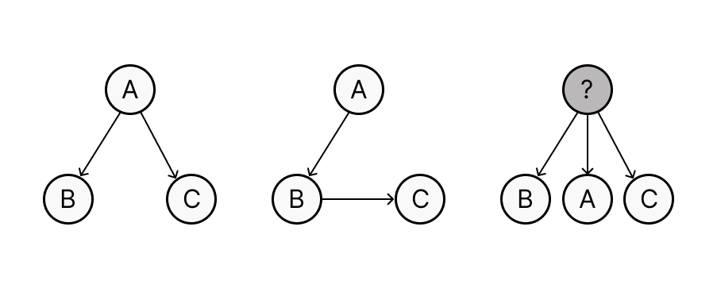

## About

In this notebook we will explore the concept of "partial correlation" and see how it relates to linear regression.

We will need the following libraries, make sure they are installed on your machine.

```{r}

library(ppcor)     # install.packages("ppcor") if needed
library(tidyverse) # loaded after ppcor so dplyr::select wins
library(GGally)   # for ggpairs()


library(lavaan)
library(semPlot)

```

## Data

We will use simulated data containing 3 variables: age, sleep_quality and reaction_time.

-   age: the age of the person, expressed in years
-   sleep_quality: an index of people's quality of sleep ranging from 1 to 10; higher values mean better sleep
-   reaction_time: reflects how fast people can press a key in response to a loud sound, expressed in seconds since the onset of the sound.

```{r}

sleep_data <- read_csv("data/sleep.csv")
head(sleep_data)
```

```{r}

ggpairs(sleep_data)

```

Using `ggpairs()` we can plot the scatterplot of all pairs of variables as well as display all pairwise correlations.

What can we conclude from this?

> Write your answer here


What can you say about the relationship between `sleep_quality` and `reaction_time`?

> Write your answer here


What type of analysis would you do next? Why?

> Write your answer here


## Causal models

There are many different ways we can think of the relationship between three variables and the presence/absence of relationships between them.

{fig-align="left"}


Based on prior work, we may believe that getting older causes both a worsening of the sleep quality and a slowing down of cognitive and motor processes.

Thus when we see the correlations between response time and sleep quality, it is not clear if there is a genuine causal relationship (e.g., sleeping well causes better cognitive and motor functioning) OR if that correlation exists only because age affects both sleep quality and response speed—if we could "remove" the effect of age, perhaps we would no longer see a relationship between sleep quality and response time.

This type of questions are questions about the causal relationships that are responsible for the data that we observe; they are the type of questions that matter most in science.


## Partial correlations


What can we do to determine if two variables x, and y, remain correlated when controlling for a third variable z?


### Linear regressions 


The idea is pretty straightforward. Instead of looking at the correlation between x and y directly $r_{xy}$ we are first going to do 2 linear regressions lm(x ~ z) and lm(y ~ z). These regressions will tell us how much z is useful in predicting/explaining x and y respectively. 

Next we will look at the part of x that is not explained by z (i.e., the residuals of lm(x~z))--let's call these $e_{x|z}$ and the part of y that is not explained by z (i.e., the residuals of lm(y~z))--let's call these $e_{y|z}$.  

More specifically, we will correlate these two residuals: if there is a correlation between $e_{x|z}$ and $e_{y|z}$, this correlation cannot be explained by z and may thus represent a direct causal link between x and y.  


```{r}

# Step 1
model_sleep_age  <- lm(sleep_quality    ~ age, data = sleep_data)
residuals_sleep <- residuals(model_sleep_age)   # sleep quality unexplained by age

# Step 2
model_rt_age  <- lm(reaction_time ~ age, data = sleep_data)
residuals_rt <- residuals(model_rt_age)   # RT unexplained by age

# Step 3
r_sleep.res_rt.res <- cor(residuals_sleep, residuals_rt)


cat("Partial r(sleep, RT | age) =", round(r_sleep.res_rt.res, 4), "\n")

```


```{r}
# Bivariate correlation
r_sleep_rt <- cor(sleep_data$sleep_quality, sleep_data$reaction_time)


cat("'Regular' correlation:  r(sleep, RT) =",       round(r_sleep_rt, 4), "\n")
cat("Partial correlation:  r(sleep, RT | age) =", round(r_sleep.res_rt.res, 4), "\n")
```


### Partial correlation formula and code

The above method provides an intuitive way to understand partial correlations; however, in practice we can get estimates of partial correlations using more effective methods. 


#### Formula

Partial correlation can be computed directly in simple cases like the one we presented.

The partial correlation of x and y controlling for z is:
$$
r_{xy \cdot z} = \frac{r_{xy} - r_{xz} \cdot r_{yz}}{\sqrt{(1 - r_{xz}^2)(1 - r_{yz}^2)}}
$$

```{r}
# Extract the pairwise correlations we need
r_xy <- cor(sleep_data$sleep_quality,   sleep_data$reaction_time)  # r(x, y)
r_xz <- cor(sleep_data$sleep_quality,   sleep_data$age)            # r(x, z)
r_yz <- cor(sleep_data$reaction_time,   sleep_data$age)            # r(y, z)

cat("r(sleep, RT)    =", round(r_xy, 4), "\n")
cat("r(sleep, age)   =", round(r_xz, 4), "\n")
cat("r(RT,    age)   =", round(r_yz, 4), "\n")


# formula for computing partial correlation

r_xy.z_formula <- (r_xy - r_xz * r_yz) /
  sqrt((1 - r_xz^2) * (1 - r_yz^2))

cat("Partial r(sleep, RT | age) =", round(r_xy.z_formula, 4), "\n")

```

#### Code

There are libraries that provide convenient code to compute partial correlations for more advanced cases while also providing options and richer outputs.


We can compute the partial correlation between two variables while controlling for all other variables in our dataset using `pcor` from the `ppcor` package:

```{r}
pcor_result <- pcor(sleep_data)


```

The output `pcor_result` contains a lot of information — have a look!

We are mostly interested in the partial correlation between `sleep_quality` and `reaction_time`:


```{r}
cat("Partial r(sleep, RT | age) =",
    round(pcor_result$estimate["sleep_quality", "reaction_time"], 4), "\n")
```
As you can see, we get the same value as before.


Note that `pcor` also provides a p-value to test if the partial correlation is significantly different from 0.

```{r}
cat("p-value =",
    round(pcor_result$p.value["sleep_quality", "reaction_time"], 4), "\n")


```


What do you conclude from these results? 

> Write your answer here


#### The lavaan package

```{r}
# Reference: Rosseel (2012). lavaan: An R Package for Structural Equation Modeling. Journal of Statistical Software, 48(2), 1–36.
library(lavaan)
```

The `lavaan` package is the most popular package in R to run SEM analysis. SEM comprises many different analyses as special cases: linear regression, path analysis, factor analysis and partial correlation analyses are all special cases of SEM and hence you can do them using `lavaan`.

The following code shows how to do that. 


##### Model specification


At the heart of lavaan is the specification of a model: this is a text that uses special notation to describe how you think the different variables relate to one another, and where you can also define latent variables (not the case in this example).


```{r}
lavaan_model <- "
  # Regress both variables on the confounder (age)
  sleep_quality    ~ age
  reaction_time ~ age

  # Residual covariance between sleep quality and RT after removing age
  # (standardized, this equals the partial correlation)
  sleep_quality ~~ reaction_time
"
```


Once we have specified the model, we can use lavaan to fit the model to the data.


```{r}
lavaan_fit <- sem(lavaan_model, data = sleep_data,
                  std.ov = TRUE)  # standardize all observed variables before fitting,
                                  # so all coefficients are in SD units and the residual
                                  # covariance equals the partial correlation directly

```


Once the model is fit, we can look at the results:

```{r}
summary(lavaan_fit, standardized = TRUE, fit.measures = TRUE)

```


Where is the partial correlation between sleep_quality and reaction_time, controlling for age?

> Write your answer here


##### Path diagram

We can visualise the model structure and the estimated (standardized) coefficients using `semPlot`:

```{r}
semPaths(
  lavaan_fit,
  what           = "std",
  layout         = "tree2",
  nodeLabels     = c("Sleep\nQuality", "Reaction\nTime", "Age"),
  edge.label.cex = 1,
  sizeMan        = 11,
  node.width     = 1.2,
  curve          = c(0, 0, 4, 4),
  nCharNodes     = 0,
  residuals      = FALSE,
  style          = "ram",
  title          = FALSE,
  mar            = c(10, 5, 5, 5)
)
```

Single-headed arrows show the standardized regression coefficients. The double-headed curved arrow between Sleep Quality and Reaction Time is the residual covariance — its standardized value is the partial correlation $r_{xy \cdot z}$.


```{r}
# Extract the "partial" correlation
params <- parameterEstimates(lavaan_fit, standardized = TRUE)
r_lavaan <- params |>
  filter(lhs == "sleep_quality", op == "~~", rhs == "reaction_time") |>
  pull(std.all)

cat("Partial r (lavaan) =",
    round(r_lavaan, 4), "\n")
```


## Conclusion

The data doesn't "speak for itself". There are often many different types of causal models that could equally well explain the same observations. 

We've seen the concept of partial correlation as a means to probe for the potential *specific* relationship between two observed variables: if there was a bivariate correlation that disappears when controlling for a third variable, then there might in fact be no relationship between those variables. 


We've also seen various methods to compute those partial correlation in practice, with a very brief glimpse at the lavaan package.


